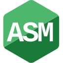
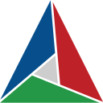

<h3>Hello, I'm sph1nxis,</h3>

a systems-oriented developer

<table>
  <tr>
    <td><b>Languages:</b></td>
    <td>
      
      
      
      
    </td>
  </tr>
  <tr>
    <td><b>Tooling:</b></td>
    <td>
      
      
      
    </td>
  </tr>
</table>

<h3>Interests:</h3>
<ul>
  <li>Operating systems</li>
  <li>Networking</li>
  <li>Low-level software</li>
  <li>Information security</li>
</ul>

